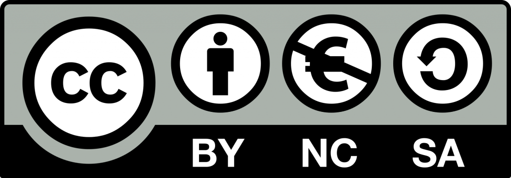

# Iniciación a contenedores Docker para el desarrollo

Bienvenidos y bienvenidas a la web sobre Docker creada por **Pedro Joya Máñez**, profesor de Informática del IES Saladillo de Algeciras (Cádiz).

Esta web ha sido desarrollada a partir del material del curso "Iniciación a contenedores Docker para el desarrollo", realizado por Juan Diego Pérez Jiménez y publicado bajo licencia Creative Commons Reconocimiento No comercial Compartir igual 4.0.

